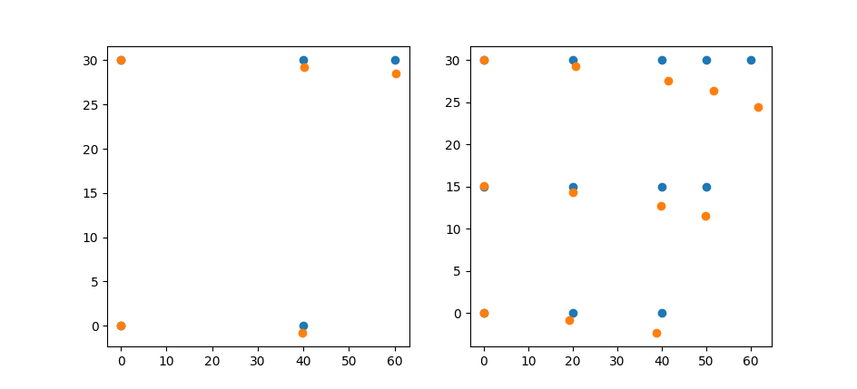

# FEA py
Simple Finite Element Analysis (FEA) code written in Python,
it is for 2D thin plate of arbitrary shape.
Currently only support these 2 elements.
However, additional elements can be easily added by specifying their element stiffness matrix (K) and shape function derivative matrix (B) implementations.
When implementing K,
it is important to keep parameters accepted and values returned by K the same across different element types,
as they are called the same way within the evaluate function in .
The figure below is created with .
Subplot left to right is FEA with linear and quadratic triangular elements respectively.

# Dependencies
- NumPy
- Matplotlib

# References
- Textbook of Finite Element Analysis, by P. Seshu, ch 5.4
